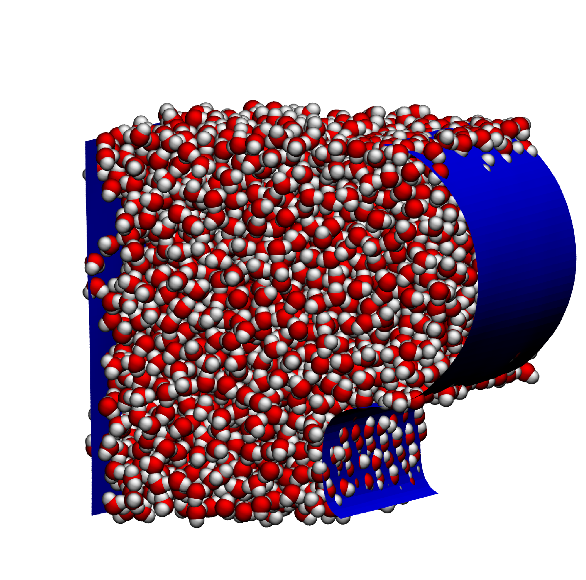
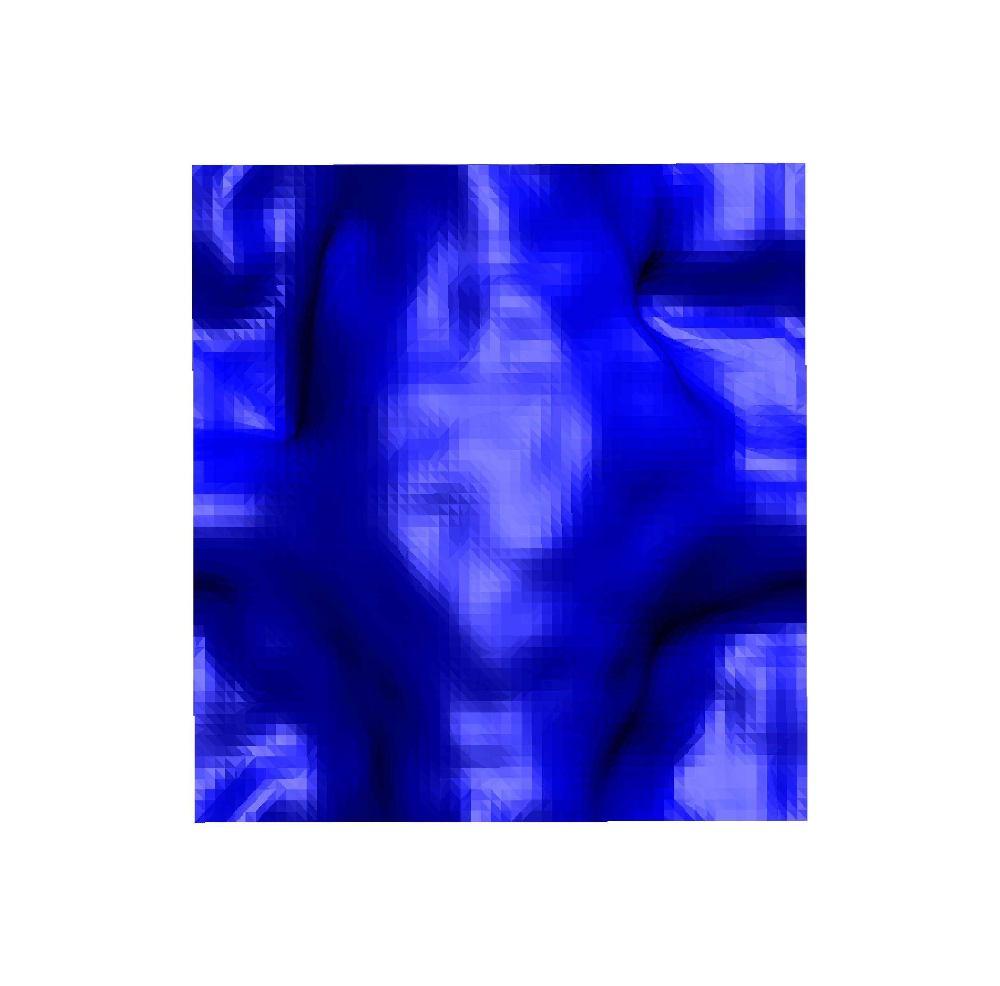
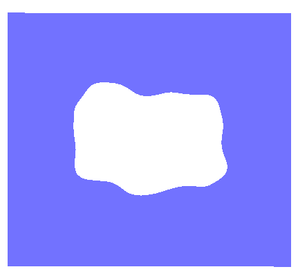
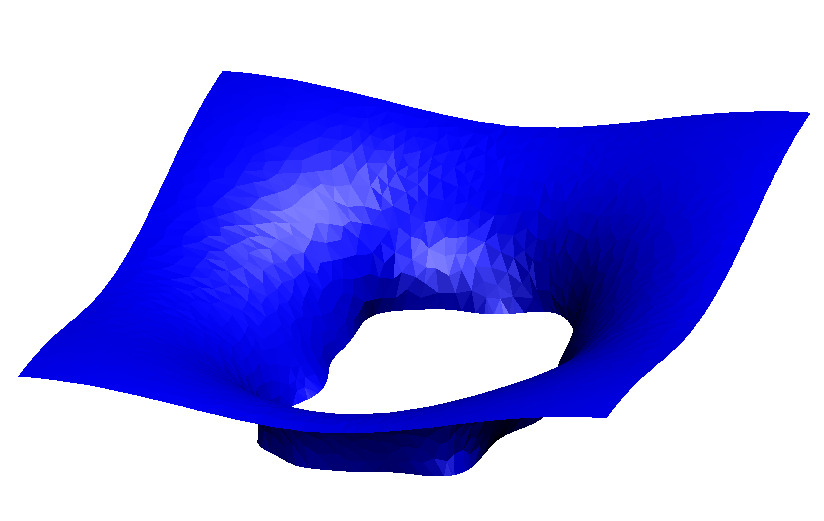

# InstantaneousInterface

A high-performance C++ and CUDA package for obtaining **molecular interfaces** from molecular simulations
---

## 🚀 Features
- 📈 Curvature analysis for surfaces
- 🔗 GROMACS compatible
- 🧵 Parallelized with CUDA/OpenMP
---

## Generating Averaged Interface
Using the method of obtaining instantaneous liquid interface from ref[1] to obtain instantaneous and average liquid interfaces. Shown below is a snapshot of an average water/oil interface where we can clearly that the interface (in blue) on average separates the liquid and the oil (not shown). It does not look perfect because the molecular picture shown is for a particular frame while the interface is averaged over many frames.

## Surface smoothing
Using this code, you can also smooth very rugged surfaces. Especially surfaces straight from marching cubes
| Unsmoothed  | Smoothed |
| ----------  | -------- |
|  |   |

## Surface evolution based on defined curvature
Using this code, we can start with some predefined surface and boundary condition and evolve to whatever curvature user defines
| k=0  | k=0.12 nm-1 |
| ----------  | -------- |
|  |   |

# References
1. Willard, Adam P., and David Chandler. "Instantaneous liquid interfaces." The Journal of Physical Chemistry B 114.5 (2010): 1954-1958.
